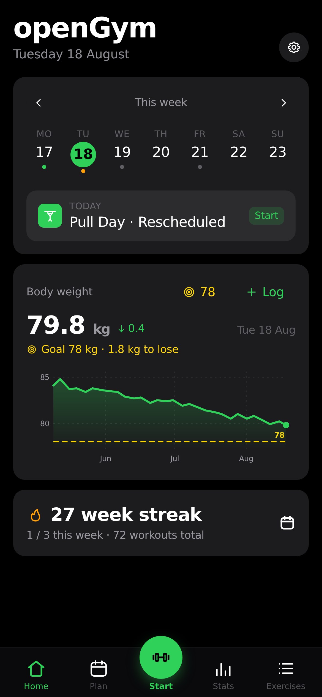
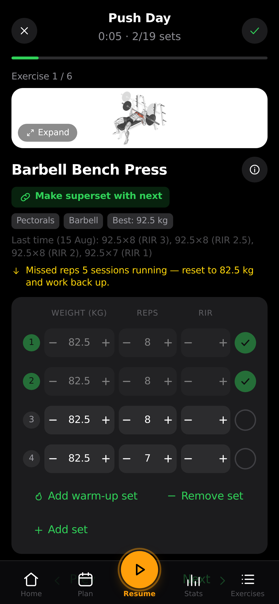
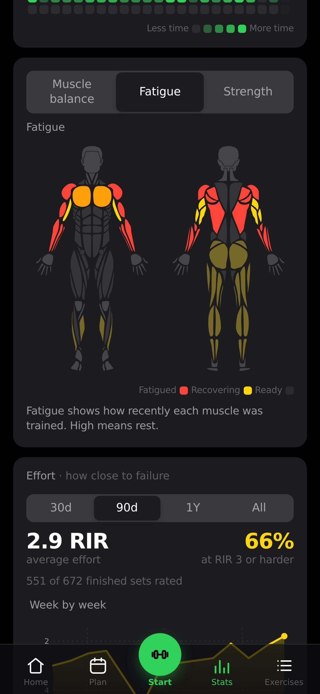

<div align="center">

# Sky

**A personal, backend-free fork of [openGym](https://gitlab.com/DuarteSantos8/opengym)** — a gym &
body-weight tracker that lives entirely on your device.

Plan your week, run guided workouts, track every set and your body weight over time.
No login, no accounts, no server, no sync: everything stays in your browser's storage,
with one-tap JSON export/import as the escape hatch. Installable as a home-screen PWA.

<br>

[](LICENSE)


</div>

> **What is this?** A single-user fork of [openGym](https://gitlab.com/DuarteSantos8/opengym)
> (upstream v1.2.9) with the whole server era stripped out: login/passkeys/accounts, sync,
> admin dashboard, push notifications, demo data, Docker/nginx/CI packaging and all but the
> English locale are gone. What remains boots straight into an empty log and never talks to
> a network except to load exercise media from a CDN. Sky's own code inherits upstream's
> **GNU AGPL v3** — see [License](#license).

<br>

<div align="center">
<table>
<tr>
<td align="center"><br><sub><b>Home</b> — today's workout & weight</sub></td>
<td align="center"><br><sub><b>Guided workout</b> — animated demos & sets</sub></td>
<td align="center"><br><sub><b>Stats</b> — heatmap, charts & PRs</sub></td>
</tr>
</table>
</div>

## Why

Most workout apps lock your data behind a login on their servers, nag you to upgrade, or
disappear when the startup does. Sky keeps openGym's opposite instinct and points it at one
person: **the data stays on your device, in storage you control, exportable any time**, and
the app itself is small enough to hold in your head. It still feels modern — installable as
a home-screen app with offline support.

## Features

- ⚖️ **Body-weight tracking** — interactive chart with a goal line you set, gains/losses colored by whether they move toward it
- 🏋️ **Weekly plan** — a routine per weekday, over a library of **1,324 exercises** (searchable, with animated demos)
- 🗓️ **Reschedule any day** — sick, missed a session, or fewer gym days this week? Move a workout to another day without touching your weekly plan
- ▶️ **Guided workouts** — it knows what day it is and starts today's session; asks your body weight first, pre-fills your weights from last time, rest timer, PR detection, per-exercise weight tracking
- ☀️ **The screen stays awake while you train** — no unlocking the phone and finding your place again between every set. On for as long as a workout is running, released the moment you finish it, and switchable off in Settings
- 🔗 **Supersets** — plan them into a routine or pair two exercises *mid-session* with “make superset with previous/next”, then work through the group back-to-back with a single rest at the end of each round. Unpair at any time; a group of one dissolves itself
- 🔥 **Warm-up sets** — mark the ramp-up rows as warm-ups and they stay out of the numbers that should not see them: no effect on your estimated 1RM, your progression, or the fatigue map, while still being there in the session where you need them. A weight change cascades down the rows that share their phase, not across the divide
- ➖ **Change your mind mid-session** — add an exercise you decided to do, or remove one you didn't, without ending the workout. Removing a member of a superset asks which one
- ⏱️ **Timed exercises** — planks, hangs, wall sits and loaded carries are logged by time, not reps, with a work timer that counts the set itself (separate from the rest timer) and logs the time you actually held. They can carry weight too
- 📈 **Progression that follows a rule** — pick one per routine, override it per exercise: linear, **Greyskull LP** (AMRAP top set, double jumps, 10 % resets), double progression through a rep range, or adding time. Your weights are already right when the session opens, and every target says *why* it's that number. Missed reps never advance the load, stalls trigger a deload, and bodyweight exercises progress in reps instead
- 💪 **Estimated 1RM** — per exercise, from your best eligible set (it names which one), with its own progress curve and a calculator for sets you haven't done. Won't guess above 12 reps
- 🎯 **Effort per set, in your scale** — an optional third column rating how hard a set was, as **RIR** (reps left in the tank) or **RPE** (the same judgement on a 10-point scale). Off by default; each set keeps the scale it was logged with, and nothing else reads the value — your progression and 1RM are unaffected
- 💪 **Bodyweight exercises, logged as bodyweight** — push-ups, pull-ups, dips and 300-odd others arrive knowing they carry no load, so there's no weight column and no working-weight prompt: one stepper, log the reps. Add a dip belt and it reads as an addition, and progression goes back to following the weight. Without one, reps climb — and past a ceiling you set, a set is added instead of a rep, up to the point where the honest advice is load or a harder variation
- ↔️ **Reps per side** — for lunges, single-arm rows and the rest. You log the total, the app shows the split ("8 per side"), and the target steps in twos so it never lands on a number one side can't have
- 🎲 **Freestyle sessions** — train without a plan and pick exercises as you go. Each one arrives prefilled from the last time you did it — same sets, same reps and weight by position — so an unplanned session doesn't start by asking you to retype last week
- 🏃 **Cardio** — log time + speed, not just weight × reps
- 📤 **Share a plan** — send someone your routines and week schedule as a small file (no workouts, no weigh-ins), or print it as a clean PDF. Importing merges, so their plan is never overwritten
- 🔧 **Filter by equipment** — narrow the library to what you actually own; the options adapt to what you've picked, so every combination on screen has results behind it
- ✨ **Your own exercises** — a name and a body part is enough; they behave like built-in ones everywhere, with an optional description instead of an animation
- 🟩 **Activity heatmap** — a GitHub-style year view, shaded by time spent training
- 💪 **Muscle map, three ways** — a front-and-back body diagram you can read as **Balance** (where the volume went, over a week, a month or all time — naming the muscles you *haven't* trained), **Fatigue** (what is still recovering, weighted by how close each set was to your maximum, decaying smoothly rather than expiring at a window edge) or **Strength** (how long since you trained each muscle, and behind every one the exercises that built it with their estimated 1RM). It previews what a routine hits while you build it, and shows what you just trained when you finish. Male or female figure, your pick
- 🎨 **Designed, not assembled** — light/dark themes and 8 accent colors saved locally, over a hand-drawn icon set instead of emoji, so it looks the same on every phone
- 🌍 **English only** — one language shipped means a smaller bundle and less surface to maintain
- 📥 **Bring your history with you** — import from **FitNotes** (Android and iOS), **Strong** and **Hevy**, or body weight straight out of an **Apple Health** export. Exercise names are matched against the library and anything unrecognised becomes one of your own exercises, so nothing in the file is dropped
- 📦 **Durable by design** — every save mirrors localStorage into IndexedDB and boot keeps whichever copy is newer, so storage pressure on iOS can't quietly take your log; Settings nudges you when an export is overdue
- 📤 **Yours to keep** — one-tap JSON export/import, **no telemetry**, no network calls beyond the exercise-media CDN

## Quick start

No Docker, no server, no environment file:

```bash
cd frontend
npm install
npm run dev        # local dev server
```

For production, `npm run build` emits plain static files under `dist/` (relative paths, so they
deploy unchanged to any host or subdirectory — GitHub Pages, Netlify, a folder on a stick).
On iPhone: serve it over HTTPS and use Safari's **Share → Add to Home Screen**.

Exercise animations stream from a CDN at runtime (the ~140 MB media set is never bundled);
logging, planning and stats work fully offline.

## How it works

A single-page React 19 + Vite app with **no backend**. One store holds the entire state;
every change persists locally and mirrors into IndexedDB.

- **frontend/src/store/** — the whole profile as one serializable object, saved debounced to
  localStorage and IndexedDB on every change
- **frontend/src/lib/** — training logic (progression, estimated 1RM, recovery, imports) as pure
  functions, tested with Vitest
- **boot** — restores whichever stored copy has the newer timestamp, so a partially evicted
  storage cannot silently roll history back

## Your data

Lives in your browser: localStorage (`gym_state_v1`) mirrored into IndexedDB; boot keeps the
newer of the two. **Export backup** writes a complete `sky-backup-<date>.json`; importing one
restores it. Importers from other apps merge instead of overwrite. Nothing ever leaves the
device except requests for exercise media to a public CDN — no analytics, no telemetry.

## Roadmap

Rough — a personal log, so it grows when training demands it:

- [x] Automatic progression programs (linear, Greyskull LP, double progression) with stalls and deloads
- [x] Estimated 1RM per exercise
- [x] Importers from FitNotes / Strong / Hevy (including the RPE they record), and body weight from Apple Health
- [x] Effort per set — RIR or RPE, whichever scale you think in
- [ ] Percentage / training-max programming (5/3/1-style) on top of the progression engine
- [ ] More starter plans (upper/lower, full-body, 5×5)
- [ ] Body measurements (waist, arms…) alongside weight
- [ ] Per-exercise notes & plate calculator

## Tech

React 19 + Vite (React Router, Zustand), plus exercise metadata and instruction text from
[hasaneyldrm/exercises-dataset](https://github.com/hasaneyldrm/exercises-dataset)
(MIT; media © Gym visual — see [License](#license)). No database, no server, no cloud
dependencies — `npm run build` emits plain static files.

The training logic — progression rules, 1RM estimation, how a logged session is read back —
lives in pure functions under `frontend/src/lib/` with tests next to them: `npm test` in
`frontend/`. Vitest is a dev dependency; the app ships no runtime dependencies beyond React,
the router and Zustand.

## Provenance

Sky is maintained as a personal fork and does not take public contributions.

## License

**Sky inherits the [GNU AGPL v3.0](LICENSE)** from upstream openGym: free and open source
software you can use, study, modify and share. If a modified version is ever run as a network
service, its source must be offered under the same license — a duty this fork accepts for every
change it makes, and one that keeps both openGym and Sky out of closed, proprietary hands.

**Third-party content is not, and openGym cannot sublicense it.** The exercise metadata and
instruction text originate from [ExerciseDB v1](https://exercisedb.dev/) and reach openGym through
[hasaneyldrm/exercises-dataset](https://github.com/hasaneyldrm/exercises-dataset) under the
**MIT** license. The exercise images and animations are third-party content covered by neither
that license nor the AGPL, and their ownership is **currently unresolved** — the upstream dataset
attributes them to [Gym visual](https://gymvisual.com/) under a non-transferable permission, while
[ExerciseDB/AscendAPI](https://exercisedb.io/faq) claims to be their creator and owner. A
clarification has been requested. openGym does not redistribute them (your instance fetches them
at first run) and does not relicense them. To reuse that media yourself, clear it with the rights
holder first.

Full third-party notices, including the body-diagram geometry: **[NOTICE.md](NOTICE.md)**.
