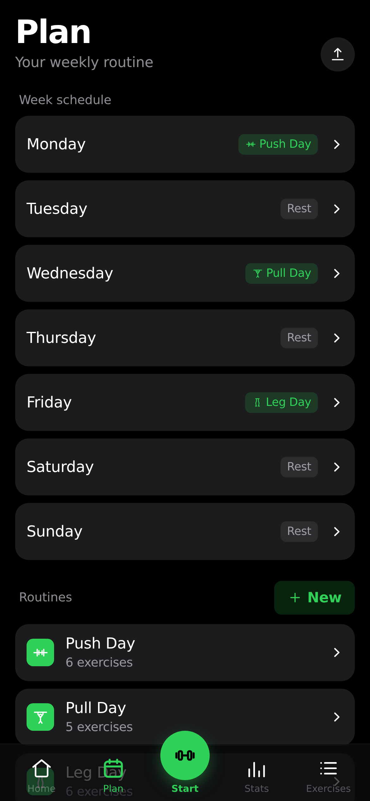
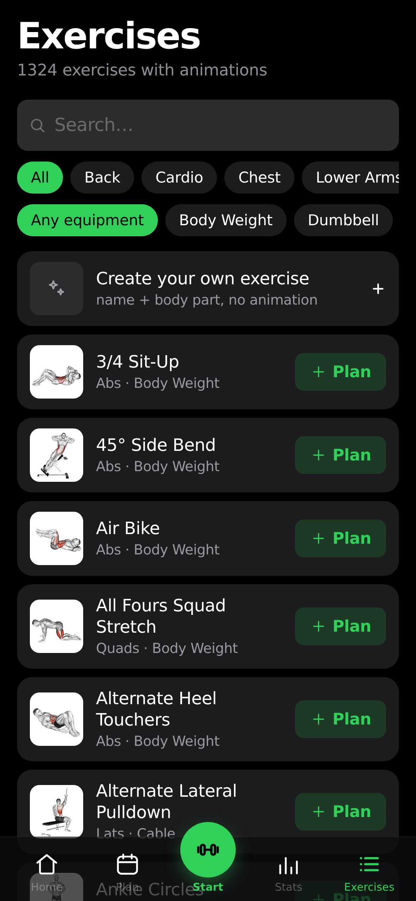

<div align="center">

# Sky

**A personal, backend-free gym and body-weight tracker.**

Plan your training week, log guided workouts, and track your body weight over time.
No user accounts, no login, no server, and no cloud sync exist.
All data stays on your local device.
You can install Sky as a progressive web application on your phone.

<br>

[](LICENSE)


</div>

<br>

<div align="center">
<table>
<tr>
<td align="center"><br><sub><b>Home</b><br>Daily session & weight</sub></td>
<td align="center"><br><sub><b>Plan</b><br>Weekly routine schedule</sub></td>
<td align="center"><br><sub><b>Workout</b><br>Guided set logging</sub></td>
<td align="center"><br><sub><b>Stats</b><br>Muscle maps & charts</sub></td>
<td align="center"><br><sub><b>Library</b><br>1,324 exercise demos</sub></td>
</tr>
</table>
</div>

## Overview

Sky is an offline fitness tracker for one person.
You do not need to create an account.
Your training history stays in your browser storage.
The application sends no tracking data and makes no background network calls.
It only connects to the internet to download exercise demonstration media.

## Key Features

### 1. Routine Planning and Week Schedule
- **Weekly Schedule**: Assign a routine to each day of the week.
- **Day Rescheduling**: Move a workout to a different day without changing your weekly plan.
- **Custom Routines**: Create routines with custom exercise lists and target sets.
- **Exercise Catalogue**: Search 1,324 built-in exercises with muscle group filters.
- **Custom Exercises**: Add your own exercises with a name and a target body part.

### 2. Guided Workout Sessions
- **Automatic Load Fill**: Pre-fills weights and reps from your last session.
- **Keep Screen Awake**: Keeps your phone display on while you train.
- **Rest Timer**: Counts down rest time between sets with audio beeps.
- **Timed Exercises**: Tracks duration for planks, hangs, and holds with a dedicated timer.
- **Supersets**: Pair adjacent exercises to perform them back-to-back.
- **Warm-Up Sets**: Mark warm-up rows to exclude them from progression and fatigue statistics.
- **Freestyle Sessions**: Train without a routine and select exercises during your workout.

### 3. Automatic Progression Rules
Sky calculates your next target weight and reps from your logged history:
- **Linear Progression**: Increases weight after all target reps are complete.
- **Greyskull LP**: Uses an AMRAP final set and resets weight after a missed session.
- **Double Progression**: Increases reps across a rep range before adding weight.
- **Add Time**: Increases target hold duration after successful timed sets.
- **Bodyweight Progression**: Adds reps up to a limit, then adds sets.

### 4. Strength and 1RM Tracking
- **Estimated 1RM**: Estimates your one-rep maximum using the Epley formula (up to 12 reps).
- **Personal Records**: Detects new load and 1RM records automatically when you finish a workout.
- **Current Strength Decay**: Estimates retained strength based on days elapsed since your last workout.

### 5. Effort Rating (RIR and RPE)
- **Optional Rating**: Rate how hard a set was after completion.
- **Two Scales**: Choose Reps In Reserve (RIR) or Rate of Perceived Exertion (RPE).
- **Effort Histogram**: Visualizes your set distribution across effort levels in Stats.

### 6. Visual Muscle Maps
Read your training through three front-and-back body diagrams:
- **Balance Map**: Shows training volume across 18 muscle groups and highlights untrained areas.
- **Fatigue Map**: Shows current muscle fatigue using a 36-hour half-life recovery model.
- **Strength Map**: Shows retained strength decay and lists the exercises that trained each muscle.

### 7. Body-Weight Tracking
- **Interactive Chart**: Track daily weigh-ins with a 30-day moving comparison.
- **Target Goal**: Set a target weight line to track your progress.
- **Workout Weigh-In**: Prompts for your body weight before each session.

## Data Control and Privacy

### Your Data Stays on Your Device
- Sky writes data to `localStorage` and mirrors it into `IndexedDB`.
- The application compares timestamps at startup to keep the newest data snapshot.
- No personal data or workout logs ever go to a server.

### Backup and Restore
- **Export Backup**: Save a complete `sky-backup-<date>.json` file from Settings.
- **Restore Backup**: Load a backup file to restore your full profile.
- **Backup Reminder**: Settings reminds you if you have not exported a backup for 14 days.

### Import History from Other Apps
You can import your previous workout history into Sky:
- **FitNotes** (Android and iOS CSV exports).
- **Strong** (CSV exports).
- **Hevy** (CSV exports).
- **Apple Health** (Body weight records from `export.xml`).

Importing merges data with your existing profile.
It matches exercise names automatically and never duplicates workouts on the same date.

### Share and Print Plans
- **Export Plan File**: Share a routine bundle with a friend without sending your workout history.
- **Print / Save as PDF**: Create a clean, formatted PDF of your routines and weekly schedule.

## How to Install and Run

### Option 1: Install as a Mobile Web App (PWA)
You can install Sky directly on your phone:

#### On iPhone (Safari)
1. Open your Sky website URL in Safari.
2. Tap the **Share** button.
3. Tap **Add to Home Screen**.

#### On Android (Chrome)
1. Open your Sky website URL in Chrome.
2. Tap the menu button (**⋮**).
3. Tap **Install app** or **Add to Home screen**.

---

### Option 2: Run Locally on Your Computer

#### Prerequisites
- [Node.js](https://nodejs.org/) version 20 or newer.

#### Steps
1. Go to the frontend directory:
   ```bash
   cd frontend
   ```
2. Install dependencies:
   ```bash
   npm install
   ```
3. Start the local development server:
   ```bash
   npm run dev
   ```
4. Open the displayed URL (default: `http://localhost:5173`) in your browser.

---

### Option 3: Build Static Files for Hosting
To build static production files:

```bash
cd frontend
npm run build
```

The output files are saved in `frontend/dist/`.
You can upload these static files to any web host (such as Cloudflare Pages, GitHub Pages, Netlify, or Nginx).

For complete hosting guides, see [docs/SELF_HOSTING.md](docs/SELF_HOSTING.md).

---

## Exercise Media

Exercise demonstration images and animations stream from a public CDN on demand.
The ~140 MB media package is not bundled in the repository.

To download all media files for offline local hosting:

```bash
cd frontend
npm run media:fetch
```

The script downloads and extracts 1,324 exercise thumbnails and GIF animations into `frontend/public/media/`.

## Testing

To run the automated test suite:

```bash
cd frontend
npm test
```

To run the fatigue calculation property test:

```bash
cd frontend
npm run test:fatigue-probe
```

## Provenance and License

Sky is a personal fork of [openGym](https://gitlab.com/DuarteSantos8/opengym) (v1.2.9).
Public server features (user accounts, server sync, push server, and admin panels) were removed.

- **Source Code**: Licensed under the **[GNU AGPL v3.0](LICENSE)**.
- **Exercise Dataset**: Distributed under the **MIT License** (from `hasaneyldrm/exercises-dataset`, derived from ExerciseDB).
- **Body Diagram Geometry**: Distributed under the **MIT License** (from Melih Colpan's MuscleMap).
- **Exercise Media**: Images and animations are third-party content (© Gym visual).

For complete legal notices, see **[NOTICE.md](NOTICE.md)**.
